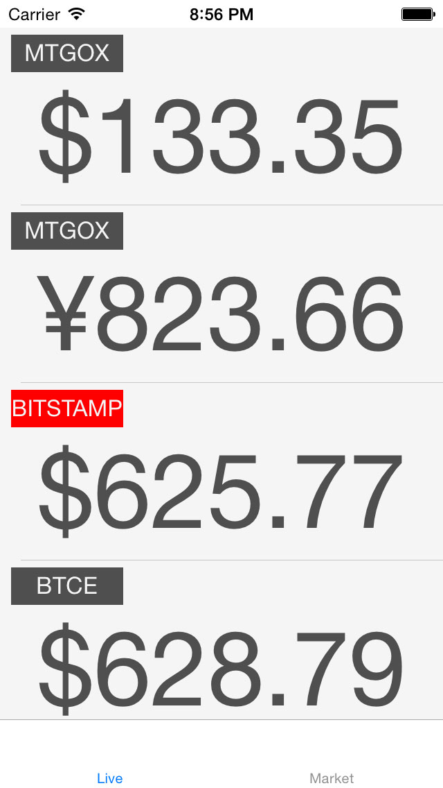

BitLive
=======

A bitcoin price tracker iOS client. Providing a simple and clean user interface to track the bitcoin prices from some major exchange.

It can also remind you the bitcoin price in in the background after turning on the alert switch.(set it to remind you when the price is higher or lower than certain number)

It's an old project so some of the APIs might be out of date.I will update the APIs in the furture.

